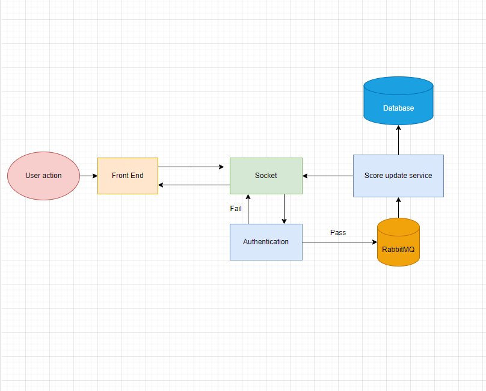

# Software Module Specification - Score Update API Service

## Description

The Score Update API Service is a module that updates the score of a user upon completion of a certain action. This action is assumed to be done by the user through the frontend website and the API call is dispatched from there. The module is responsible for validating the request and updating the score if the request is legitimate.

## Use Cases

1. User completes an action on the frontend website which requires socket to be sent to the backend application server to update the user’s score.
2. The module receives the API call and validates the request, then updates the user’s score if the request is legitimate.

## Flow of Execution

## Improvements

1. Add authentication and authorization mechanism to validate the user making the API call.
2. Use a message queue (e.g. RabbitMQ) to handle the API calls asynchronously to prevent slowing down the website.
3. Add rate limiting to prevent malicious users from sending too many API calls.
4. Add logging to monitor the module’s performance and detect any potential issues.

## Data request and response

### Request

`{
"token": String,
scoreIncrement: Number
}`

### Response

**Success**

`{
"success": true,
"data":{
"newScore": Number,
"userId": String
}
}`

**Fail**

`{  
 "success": false,
"data": null
}`
